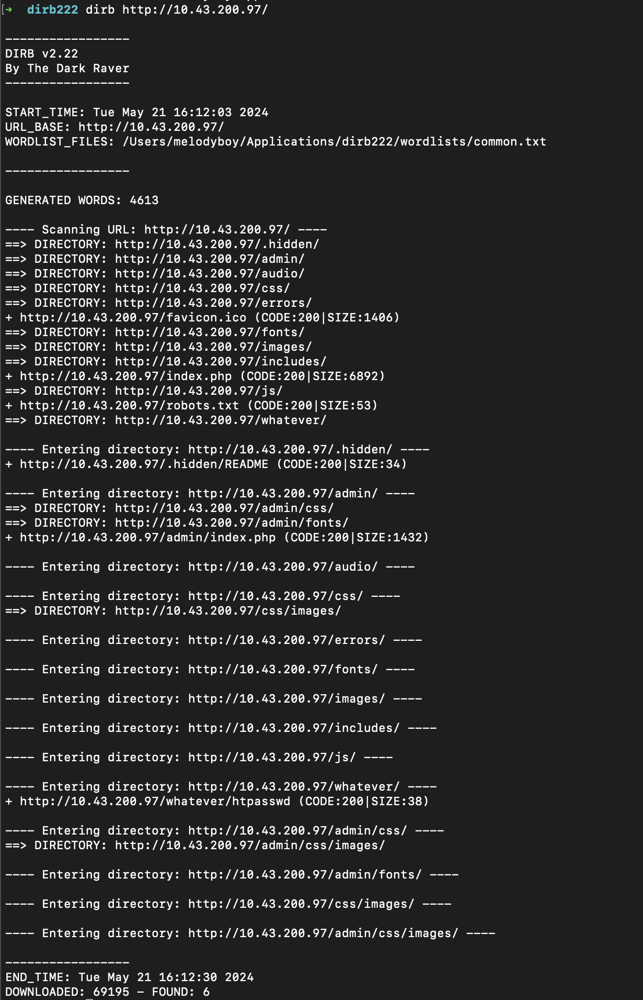
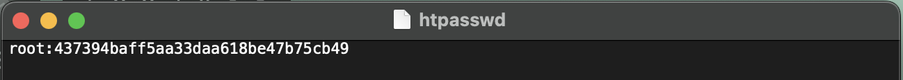
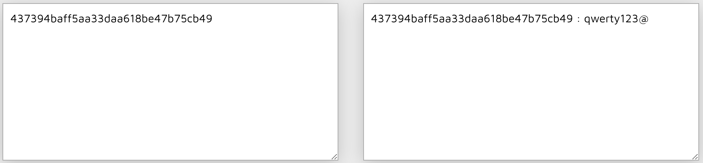
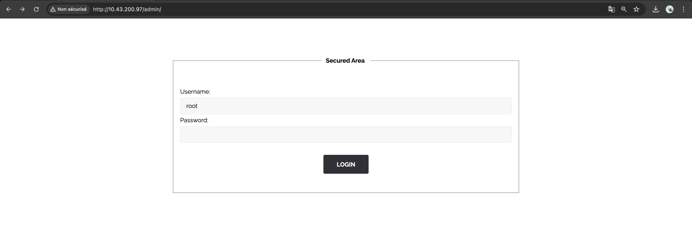

# BRUTEFORCE AUTHENTICATION

## Exploit

Upon discovering the .hidden directory and its functionalities, we employed the web content scanner [Dirb](https://www.kali.org/tools/dirb/) to further investigate. Our scan revealed the existence of an htpasswd file located at **http://<IP_ADDRESS>/whatever/htpasswd**.

Upon accessing this URL, we downloaded the .htpasswd file, which contained critical login credentials, including the root user's password that we decrypted using [md5decrypt](https://md5decrypt.net/).

Additionally, our Dirb scan identified a hidden administration page at **http://<IP_ADDRESS>/admin**.

Armed with the decrypted credentials, we attempted to access the administration page using the username **root** and the recovered password **qwerty123@**. This successful login redirected us to a page containing a new flag.

