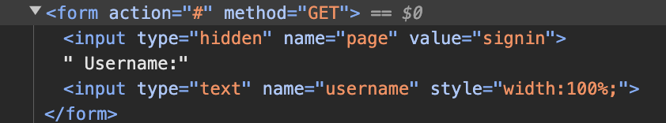
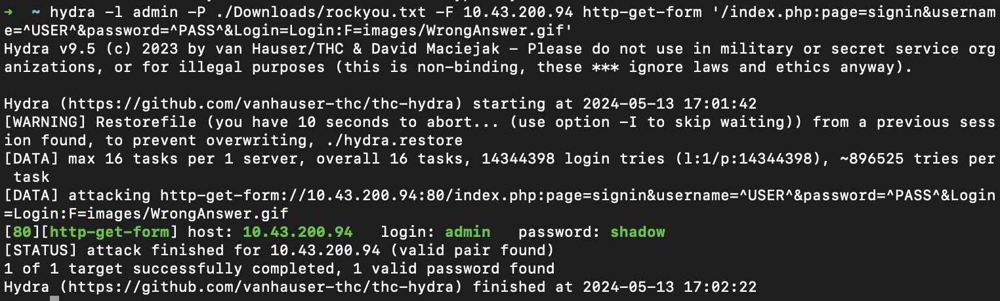
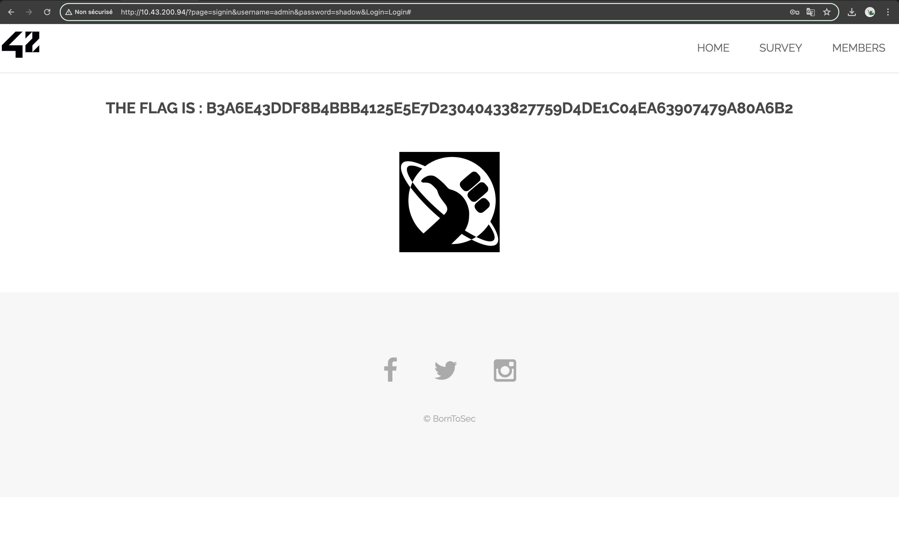

# BRUTEFORCE AUTHENTICATION

## Exploit

After browsing through the website, we found a login page located at **http://<IP_ADDRESS>/?page=signin**.

At first, we tried using some SQL injections to bypass the login form and get the flag. However, our attempts were unsuccessful. We, therefore, opted for a different method using brute force.

After some research, we found Hydra: a versatile and powerful tool used for performing password brute-force attacks and online dictionary attacks against various types of remote authentication services, allowing testers to assess the strength of passwords and the robustness of authentication systems.

We installed this tool using brew: `brew install hydra`. Then, we executed the following command using this [documentation](https://github.com/gnebbia/hydra_notes):

```
hydra -l admin -P ./Downloads/rockyou.txt -F <IP_ADDRESS> http-get-form '/index.php:page=signin&username=^USER^&password=^PASS^&Login=Login:F=images/WrongAnswer.gif'
```
Where:
- **-l admin**: Use **admin** as the username (we simply assumed **admin** would be a valid login).
- **-P ./Downloads/rockyou.txt -F**: Try all passwords listed in a dictionary of most common passwords suggested by this [tutorial](https://www.freecodecamp.org/news/how-to-use-hydra-pentesting-tutorial/) and exit after the first found login/password pair for any host.
- **<IP_ADDRESS>**: The IP address of our website.
- **http-get-form '/index.php:page=signin&username=^USER^&password=^PASS^&Login=Login:F=images/WrongAnswer.gif'**: We used http-get-form as it emulates form submission, distinguishing it from a standard HTTP request. We determine success by the absence of the "WrongAnswer.gif" display on the URL "http://<IP_ADDRESS>/?page=signin&username=admin&password=shadow&Login=Login#".



This command outputs the following results:



When we log in with the username **admin** and the password **shadow**, the website redirects us to this page and displays a new flag:

.