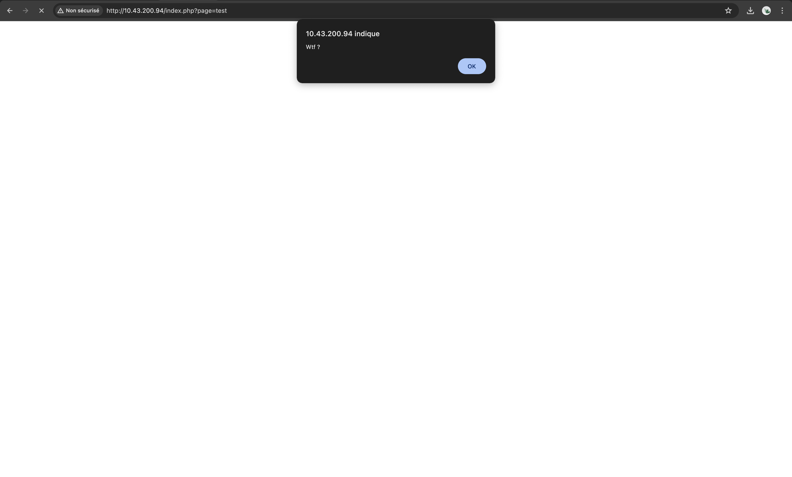
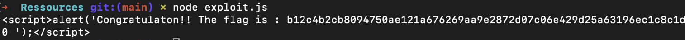

# DIRECTORY TRAVERSE

## Exploit

As [common knwolegde](https://www.linuxcertif.com/doc/keyword//etc/passwd/), every nginx server stores a configuration file named "/etc/passwd". 

Moreover, the website returns no matter what path a popup message as follows :

The idea was therefore to retrieve the contents of this popup on the server by traversing directories and searches until getting a pop up different form the one show above. We therefore created this [exploit](exploit.js "Exploit"). The script exploits a directory traversal vulnerability on a web server by iteratively traversing directories, accessing files such as "/etc/passwd", and searching for HTML script tags containing the keyword "flag" to potentially retrieve sensitive information. 

The displays the following flag :

