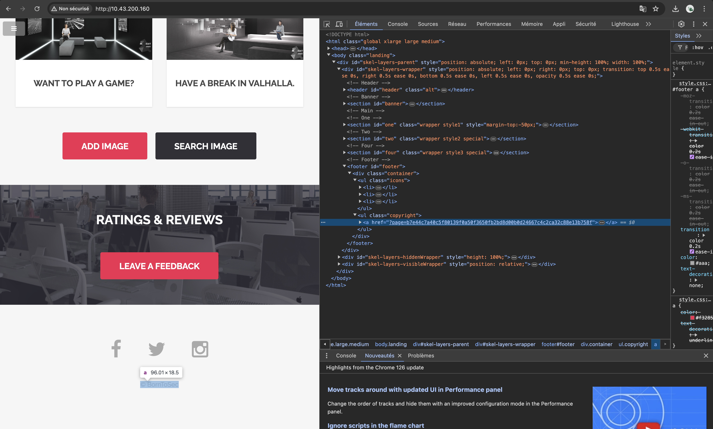
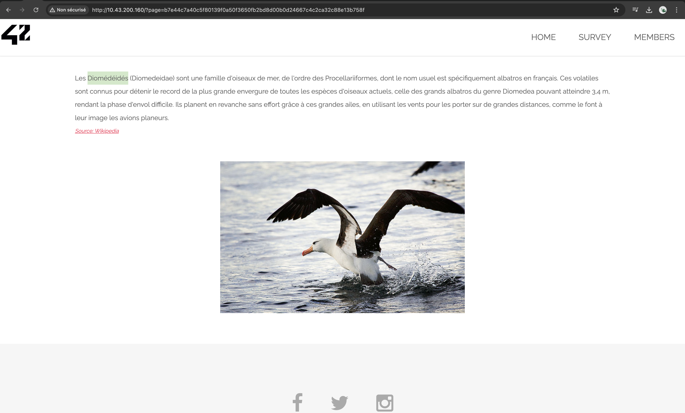
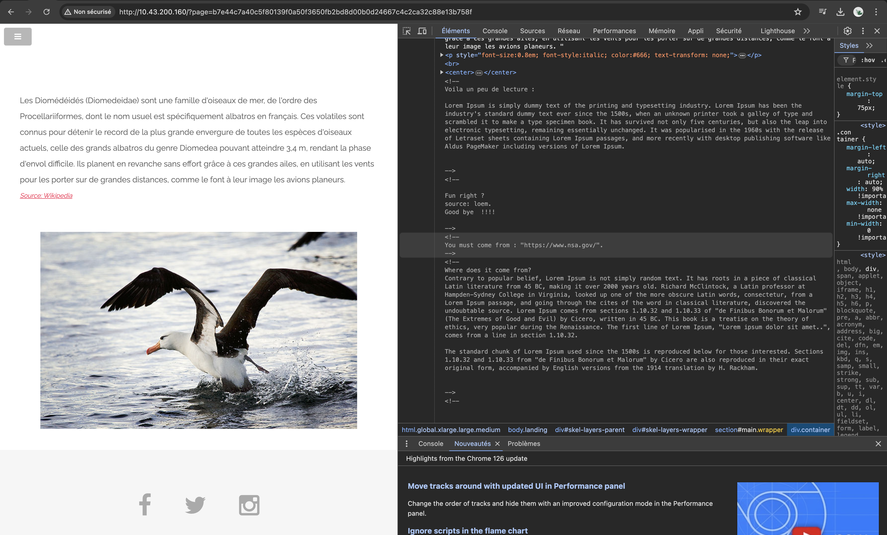
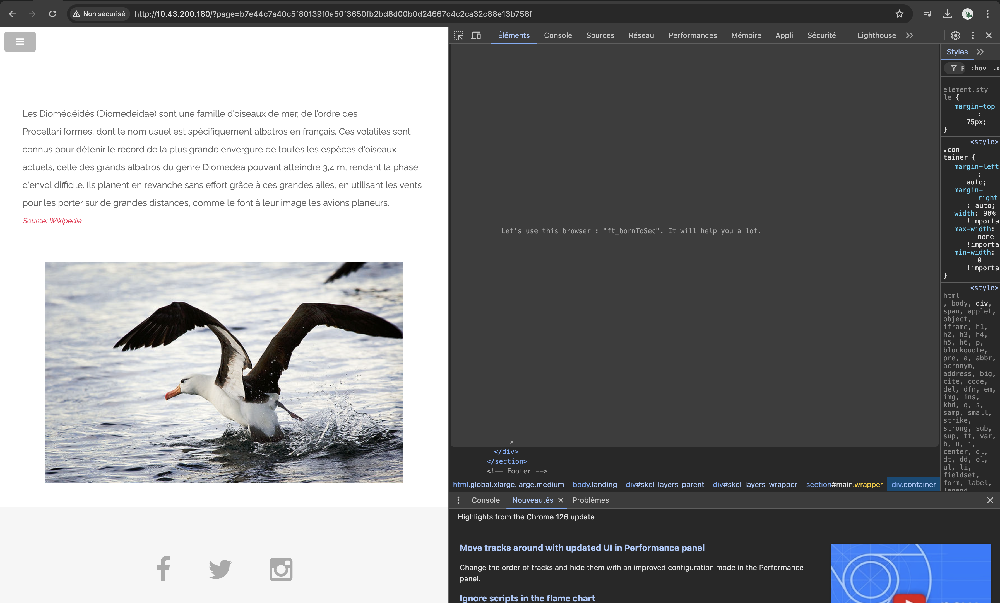
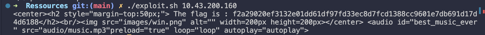

# HEADER VALIDATION BYPASS

## Exploit

While exploring the main page of the website, we found a new link in the footer leading to a different section:



This new page, located at **http://<IP_ADDRESS>/?page=b7e44c7a40c5f80139f0a50f3650fb2bd8d00b0d24667c4c2ca32c88e13b758f**, displays a short description about diomedeidae birds complemented with an image of that bird :



When inspecting the source code of the website, we noticed several comments in the code and specifically two that draw our ittention :

1. One idicating that we should come from the page **https://www.nsa.gov/**:


2. A second saying that we should be using the browser **ft_bornToSec**:



These comments appear to reference specific HTTP headers: **referer** and **user agent** :
- The **referer** header identifies the URL of the previous web page from which the current request originated. In this case, it suggests that the request must come from **https://www.nsa.gov/**.
- On the other hand, the **user agent** header identifies the software or browser being used to make the request, with **ft_bornToSe**c** being recommended in this context.

To do so we proceded by executing the following command:
```sh
curl -s -A 'ft_bornToSec' --referer "https://www.nsa.gov/" "http://<IP_ADDRESS>/?page=b7e44c7a40c5f80139f0a50f3650fb2bd8d00b0d24667c4c2ca32c88e13b758f" | grep 'flag'
```

Where:
- **curl**: Command-line tool for transferring data with URLs.
- **-s**: Operates in silent mode, showing only output data.
- **-A 'ft_bornToSec'**: Sets the user agent to **ft_bornToSec**.
- **-referer "https://www.nsa.gov/"**: Sets the referer to **https://www.nsa.gov/**.
- **"http://<IP_ADDRESS>/?page=b7e44c7a40c5f80139f0a50f3650fb2bd8d00b0d24667c4c2ca32c88e13b758f"**: Sends a request to this URL and where **<IP_ADDRESS>** should be replaced with the vulnerable website's IP address.
- **grep 'flag'**: Filters output to display lines containing **flag**.

For automation purposes, we have prepared [bash script](./exploit.sh) that streamlines this process. Simply provide the IP address of the vulnerable website as an argument, and it will attempt to upload exploit.php disguised as an image.



