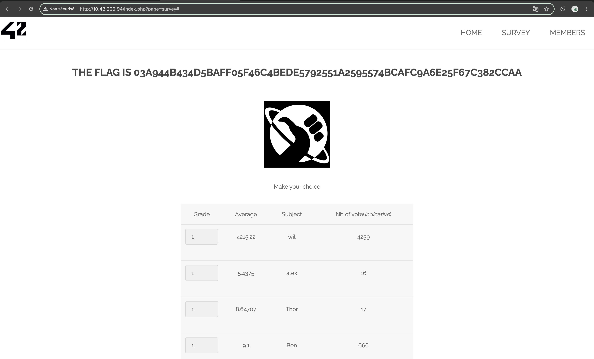
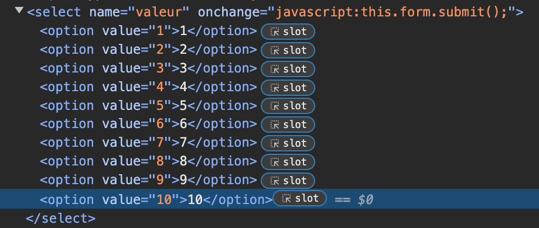

# SURVEY INPUT VALIDATION BYPASS

## Exploit

On the page "survey" located at the following URL, http://10.43.200.94/index.php?page=survey#, we are asked to note on a scale of 1 to 10 a subject. However, if we change the value of the select with of value over 10, the page prompts a new flag.

Such exploit is as called "Input Validation Bypass" or "Input Validation Evasion" attack. This term reflects the fact that the attacker is able to bypass the expected input validation mechanisms of the application by submitting values that are not properly handled or sanitized by the server-side code.

## Demonstration 

Here's the following step we proceeded to do :

Exploited versions:
