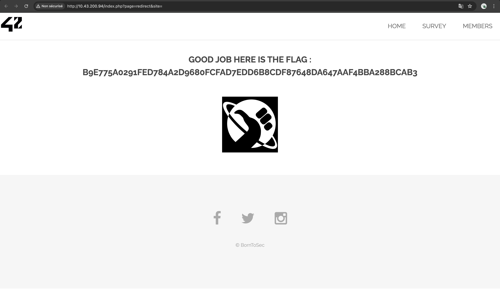

# OPEN REDIRECT

## Exploit

The website features links to popular social media platforms such as Facebook, Twitter, and Instagram. Yet, a vulnerability permits users to alter the 'site' parameter within these links, leading to a particular URL structure (http://10.43.200.94/index.php?page=redirect&site={string}). Exploiting this issue by substituting the 'site' element in the HTML anchor tag with any string (valid URL, blank or random string, etc.) triggers the display of a flag on the redirected page.



This type of vulnerability is an **open redirect**, which allows attackers to redirect users from a legitimate website to any arbitrary URL, which can lead them to malicious sites. To minimize this risk, appropriate input validation and secure redirection practices must be implemented to prevent unauthorized redirects and protect users from potential attacks.


## Demonstration 

Here's an example demonstrating the exploitation of the Facebook anchor tag (although it also applies to Twitter or Instagram anchors).


Original HTML code:
```
<a href="index.php?page=redirect&amp;site=facebook" class="icon fa-facebook"></a>
```

Exploited versions:
```
<a href="index.php?page=redirect&amp;site=https://youtube.com" class="icon fa-facebook"></a>
```
```
<a href="index.php?page=redirect&amp;site=" class="icon fa-facebook"></a>
```
```
<a href="index.php?page=redirect&amp;site=abc" class="icon fa-facebook"></a>
```
