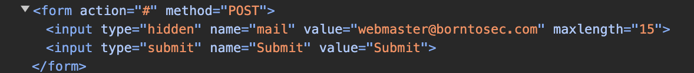
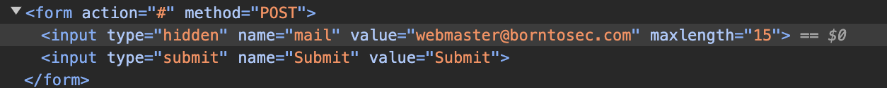
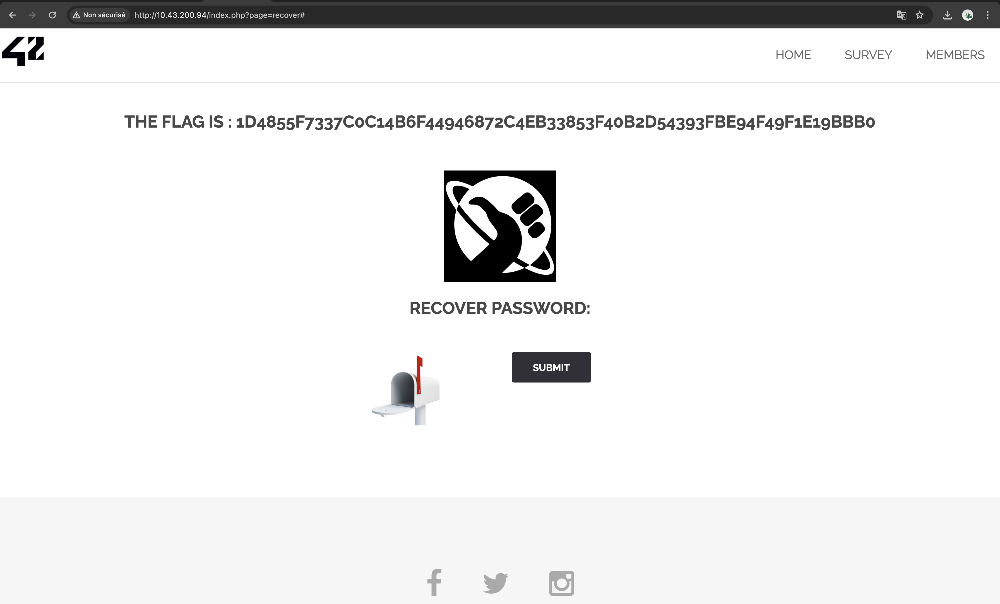

# RECOVER INPUT VALIDATION BYPASS

## Exploit

On the **recover** page located at the following URL, **http://<IP_ADDRESS>/?page=recover**, there is a form to recover a password with the following fields:

By changing the **value** of the first input tag to any string (valid email address, random string, or even an empty string) as follows:

The page prompts a new flag:

This type of exploit is called an **Input Validation Bypass** or **Input Validation Evasion** attack. This term reflects the fact that the attacker is able to bypass the expected input validation mechanisms of the application by submitting values that are not properly handled or sanitized by the server-side code.

