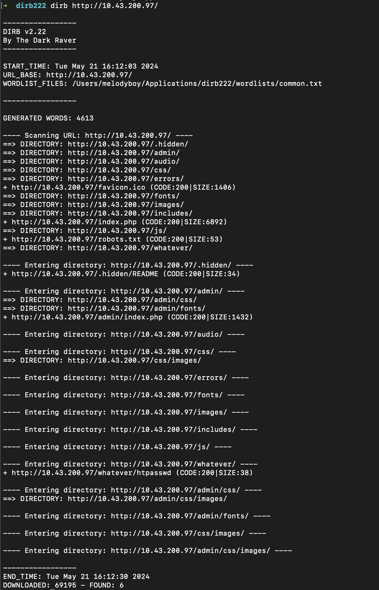
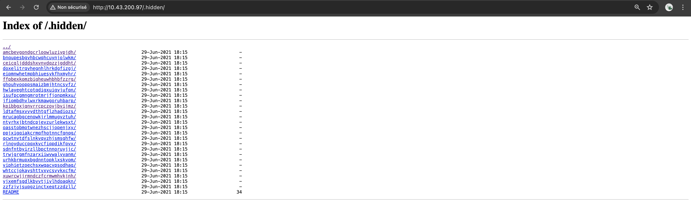

# SCRAPP .HIDDEN

## Exploit

At first, we wondered if perhaps the web application had any existing/hidden files that weren't accessible through the main pages of the website. After manually trying various common URL combinations, we decided to search for applications that could do the job for us. After some research, we found [Dirb](https://www.kali.org/tools/dirb/): a Web Content Scanner that looks for existing (and/or hidden) Web Objects. It basically works by launching a dictionary-based attack against a web server and analyzing the responses.

Therefore, after installation, we executed Dirb on our VM's URL which displayed the content shown in the image below.

```
dirb http://<IP_ADDRESS>/ 
```



Dirb displayed several existing/hidden files, including a .hidden file:
```sh
---- Entering directory: http://<IP_ADDRESS>/.hidden/ ----
+ http://<IP_ADDRESS>/.hidden/README (CODE:200|SIZE:34)    
```

On the said page is an index page with multiple directories and subdirectories, all leading to several README.md files (as shown in the image below).



We deduced that we'd have to navigate through all the different directories and subdirectories to analyze each README.md file and hopefully find one containing a flag. 

The manual task was quite tedious, so we decided to write a [JS script](./scrap.js) that would scrape the .hidden pages, automatically look through all the directories, subdirectories, and README.md files, and search for the keyword **flag**, giving us the following output and flag:


