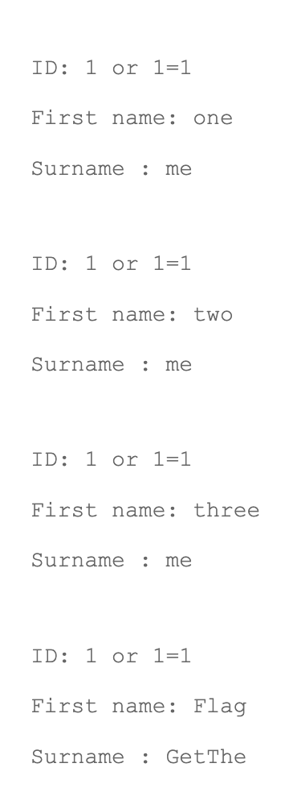
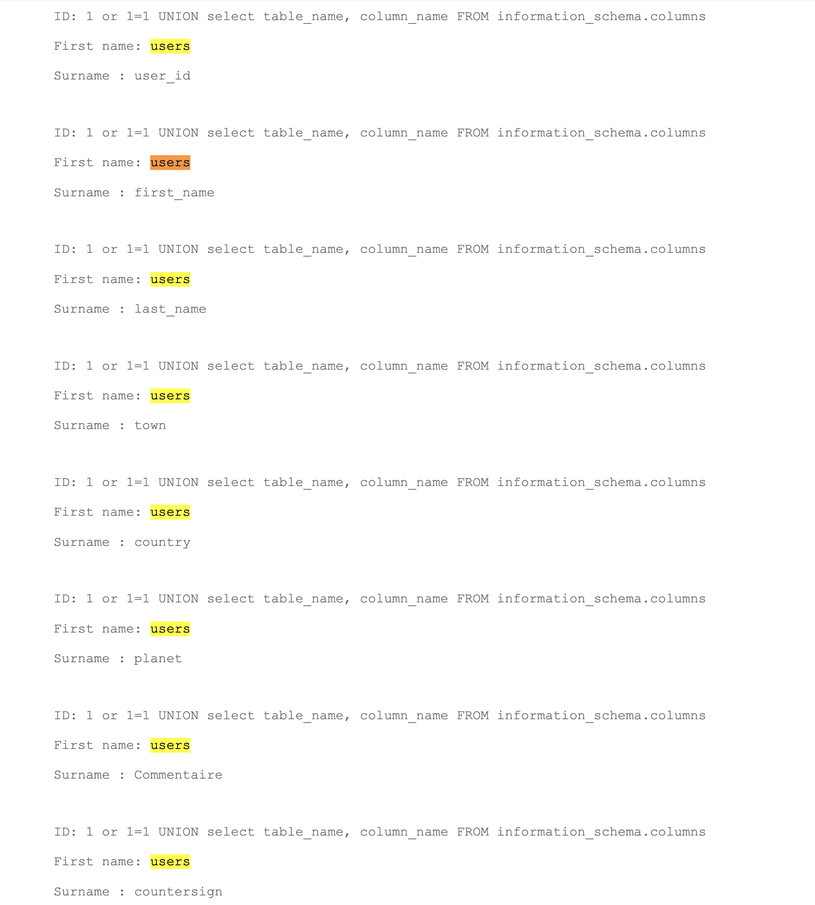
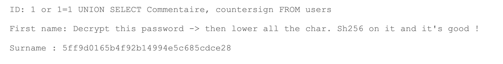

# MEMBERS SQL INJECTION

## Exploit

On the page **members** located at the following URL, **http://<IP_ADDRESS>/?page=member**, there is a search member by ID form. When entering any string in the form, a SQL error is displayed. 

We therefore suppose that we can perform a SQL injection to potentially find a new flag. 

By testing the most basic SQL injection: `1 or 1 = 1`, we received confirmation that the form is vulnerable to SQL injections:



From here, we decided to try displaying different tables in the database and their corresponding columns. After some research, we found the following method to display many columns from the database, including the "users" table, as shown below:

```sql
1 or 1=1 UNION SELECT table_name, column_name FROM information_schema.columns
```



From here, we started displayed by pairs the content of each columns of the users table : user_id, first_name, last_name, town, country, planet, Commentaire, countersign. When displayed the content of Commentaire and countersign as depicted below we landed on information concerning a flag.


We then displayed the content of each column of the **users** table in pairs: **user_id**, **first_name**, **last_name**, **town**, **country**, **planet**, **Commentaire** & **countersign**. When we displayed the content of the **Commentaire** and **countersign** columns, we found information concerning a new flag:

``` sql
1 or 1=1 UNION SELECT Commentaire, countersign FROM users
```


Therefore, we decrypted **5ff9d0165b4f92b14994e5c685cdce28** using [md5decrypt](https://md5decrypt.net/) and obtained the string **FortyTwo**.

As instructed, we then converted the string to lowercase and encrypted it using SHA256 to obtain the flag:

``` sh
echo -n fortytwo | shasum -a 256
10a16d834f9b1e4068b25c4c46fe0284e99e44dceaf08098fc83925ba6310ff5  -
``` 
