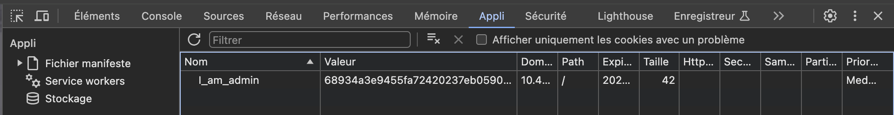
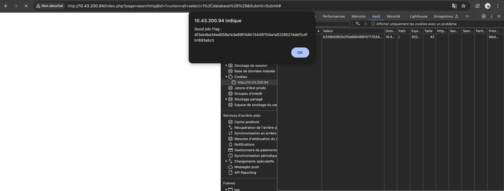

# WEAK COOKIES ENCRYPTION

## Exploit

Upon inspecting the site's storage elements, we discovered a cookie named **I_am_admin** with the following encrypted value:
``` sh
b326b5062b2f0e69046810717534cb09
```


Using an encryption/decryption tool like [md5decrypt.net](https://md5decrypt.net/), we decrypted the value of this cookie at obtained **false**. 

By deduction, we then encrypted the value **true** and replaced the cookie's value with it. Upon refreshing the page, a pop-up appeared, displaying a new flag:




