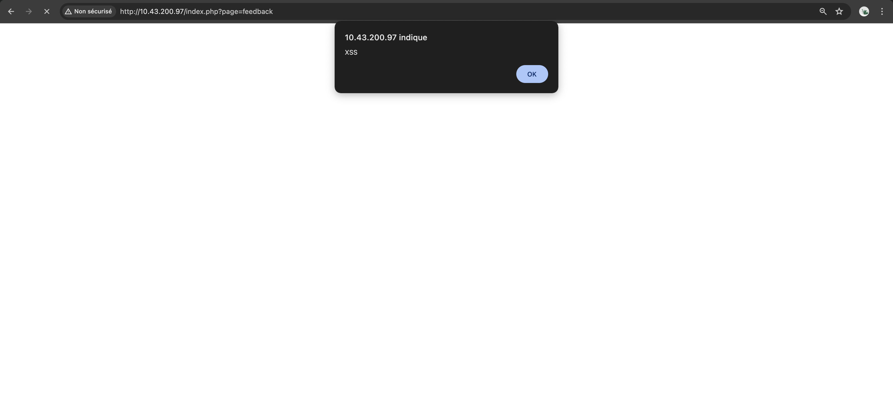
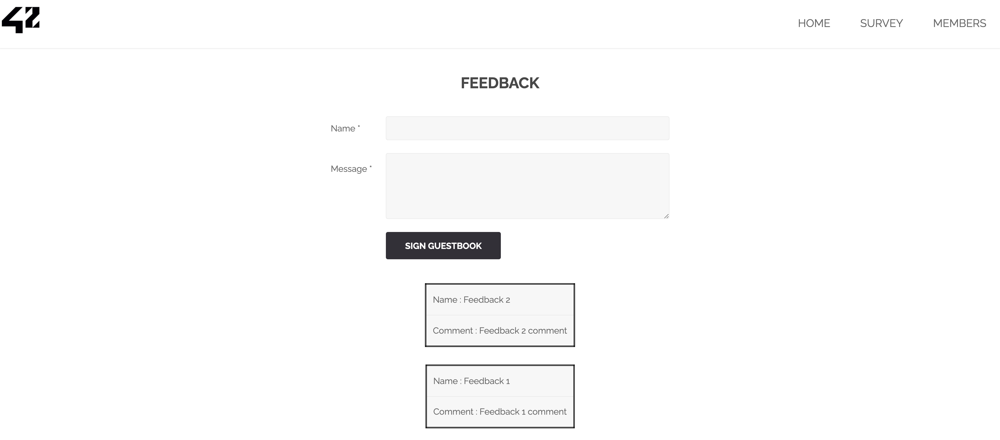
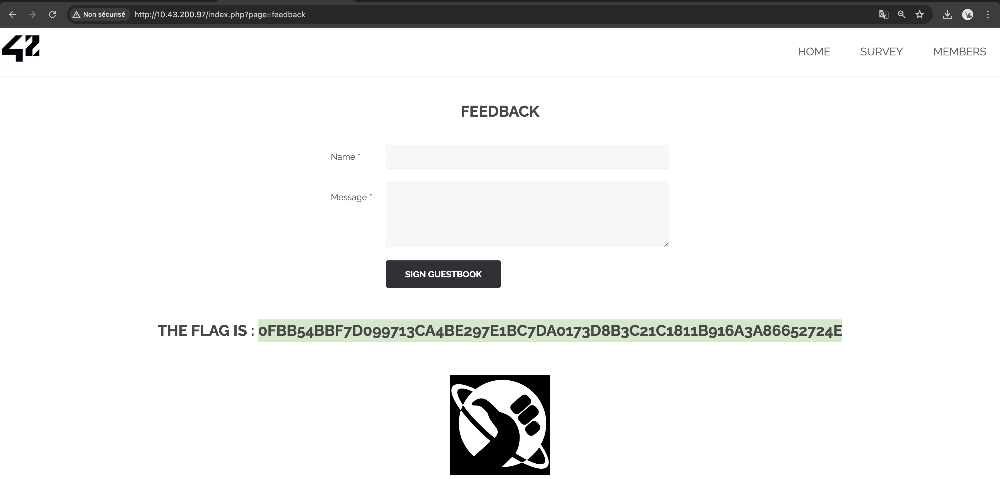

# XSS ATTACK FEEDBACK

## Exploit

On the page **feedback**, located at the URL **http://<IP_ADDRESS>/index.php?page=feedback**, there's a form with name and message fields for submitting feedback. Upon submission, the form triggers an alert with the message **XSS**:



The submitted feedback is then displayed below the form, alongside all other feedback:



The presence of alert messages indicates that this page is susceptible to [XSS attacks](https://owasp.org/www-community/attacks/xss/), a type of injection where malicious scripts are injected into trusted websites.

Our objective is to execute code via either the name or message field of the form. 

Initially, we attempted to inject a script tag directly into the message field, but the browser did not interpret it, resulting in the comments list not being displayed.

Subsequently, we tried to execute code in another way, but encountered a character limit issue in both fields. We addressed this by directly modifying the character limit in the CSS tags of the input fields:

``` html
<textarea name="mtxtMessage" cols="50" rows="3" maxlength="50"></textarea>
```

By this :
``` html
<textarea name="mtxtMessage" cols="50" rows="3" maxlength="42424242"></textarea>
```


From there, we utilized the **onload** event associated with image tags, enabling the execution of a function, such as triggering an alert.

``` html
a
```

Adding an additional character to ensure the message field has content, we injected this code into the **message** field along with a random **name**. 

As a result, the website displayed a new flag:


