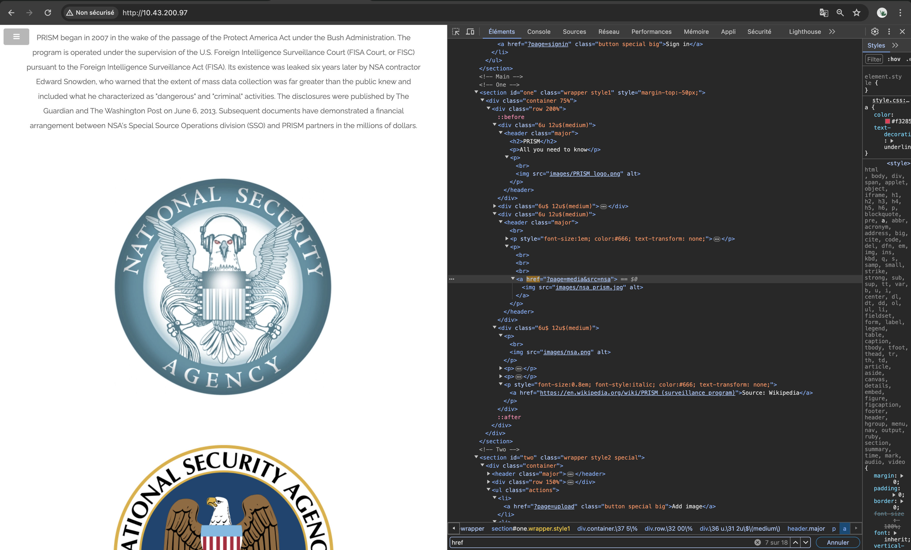
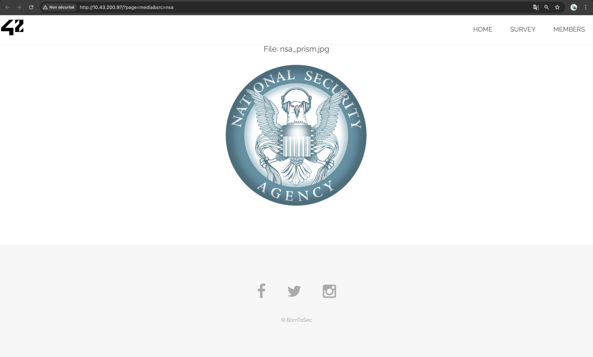
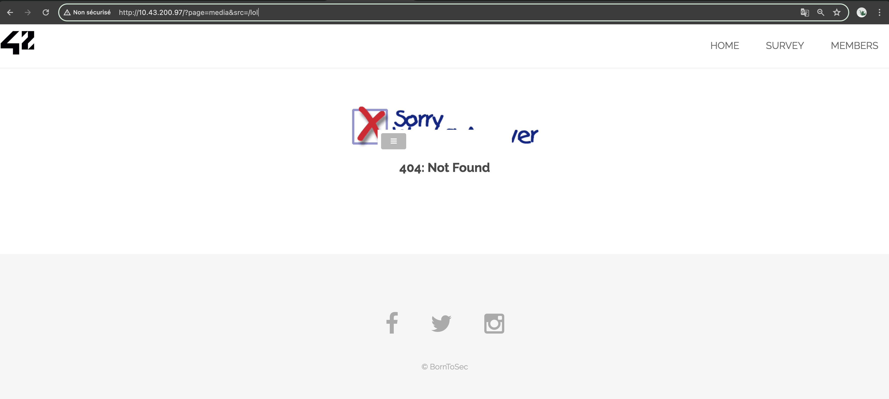
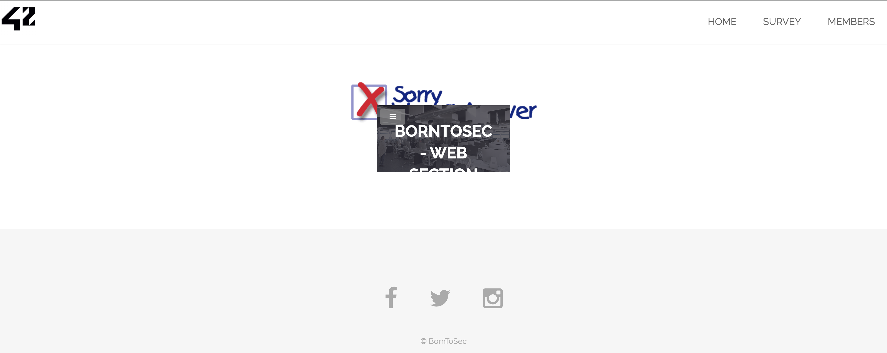
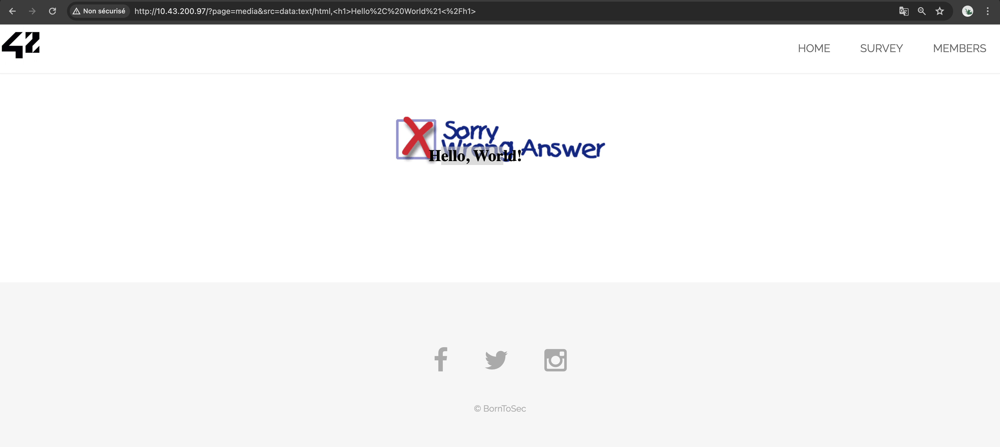
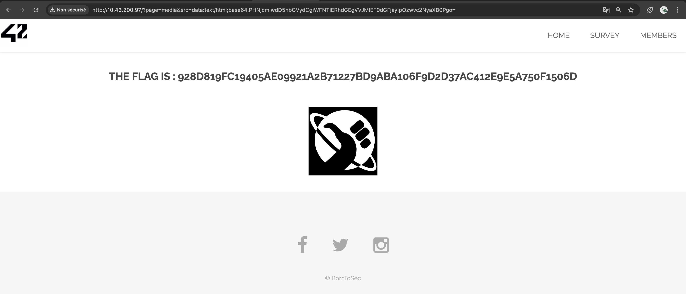

# XSS DATA URL ATTACK

## Exploit

While exploring the website for hidden pages, we noticed an inconspicuous **href** reference on the main page:



Clicking on this link redirected us to a data URL page:



Upon attempting to modify the **src** tag with a random string, we observed a **404 error** displayed within a container, revealing the entire page content along with the error message:



This prompted us to experiment with specifying a valid URL, such as the main page located at **/**, which led to its content being displayed within a container again:




After conducting some [research](https://developer.mozilla.org/en-US/docs/Web/HTTP/Basics_of_HTTP/Data_URLs), we learned that the **src** query parameter was **data URL**. Following the guidelines of tutorial linked previously, we attempted to send valid URLs and HTML tags. As a result, we discovered the potential for executing XSS attacks.



We therefore crafted a **script tag** containing a call to an **alert** function. However, due to the presence of characters defined in **RFC 3986** such as reserved characters, space characters, newline characters, or other non-printing characters, these characters needed to be URL encoded in **base64**.

```html
<script>alert("XSS Data URL Attack");</script>
```
In base 64:
```php
PHNjcmlwdD5hbGVydCgiWFNTIERhdGEgVVJMIEF0dGFjayIpOzwvc2NyaXB0Pg==
```

We then injected this encoded string into the **src** query of the URL, specifying the data URL format before it:
```php
data:text/html;base64,PHNjcmlwdD5hbGVydCgiWFNTIERhdGEgVVJMIEF0dGFjayIpOzwvc2NyaXB0Pg==
```

Executing this injection resulted in the successful execution of the XSS attack and revealed a new flag:

